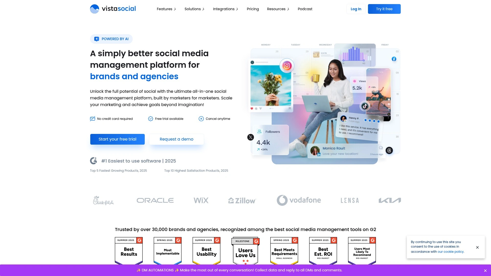
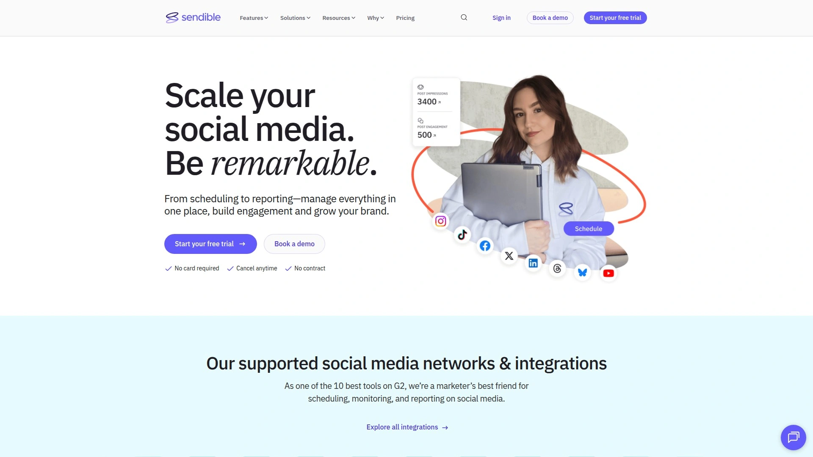
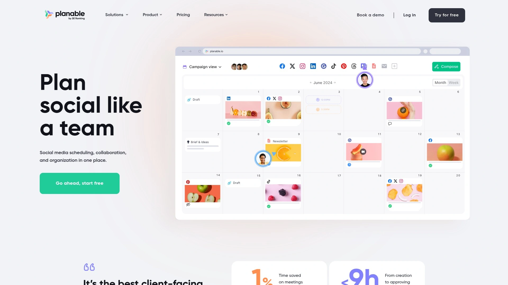
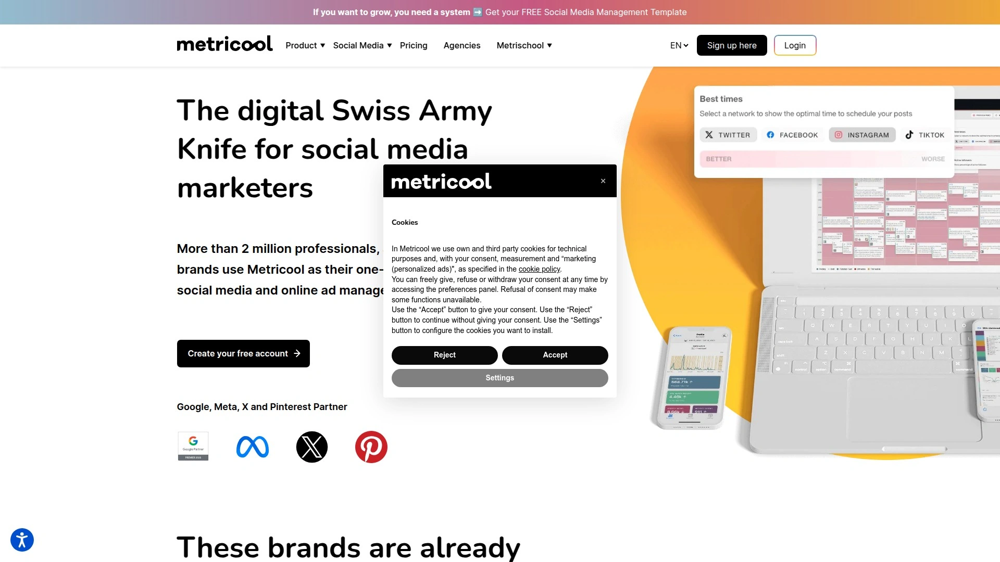
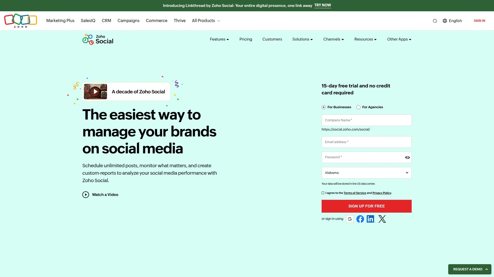
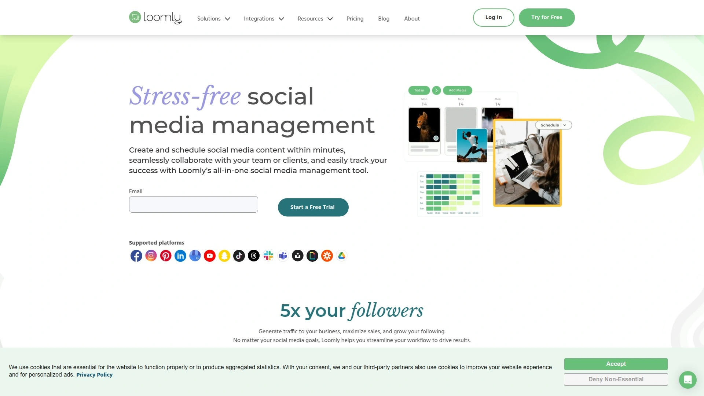
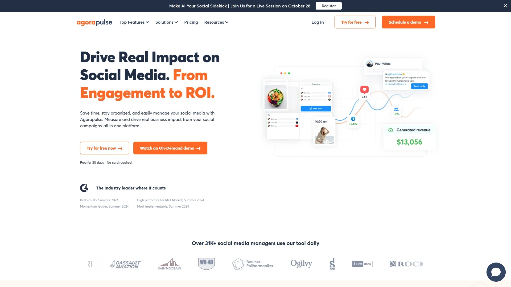
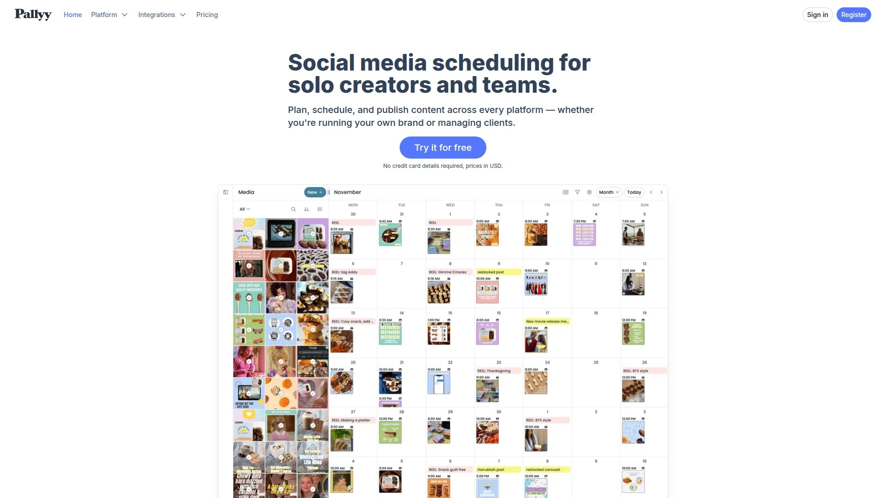
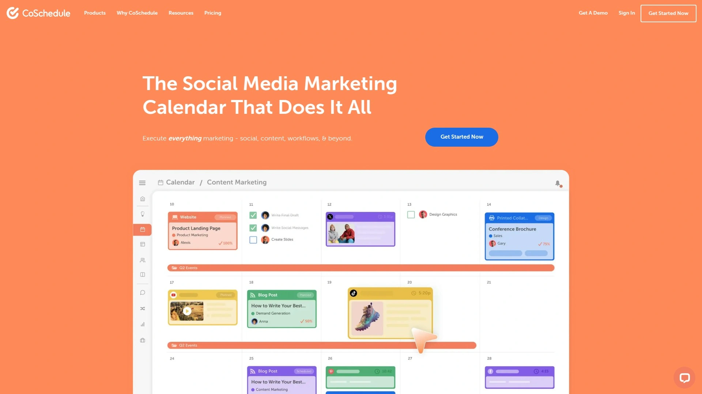
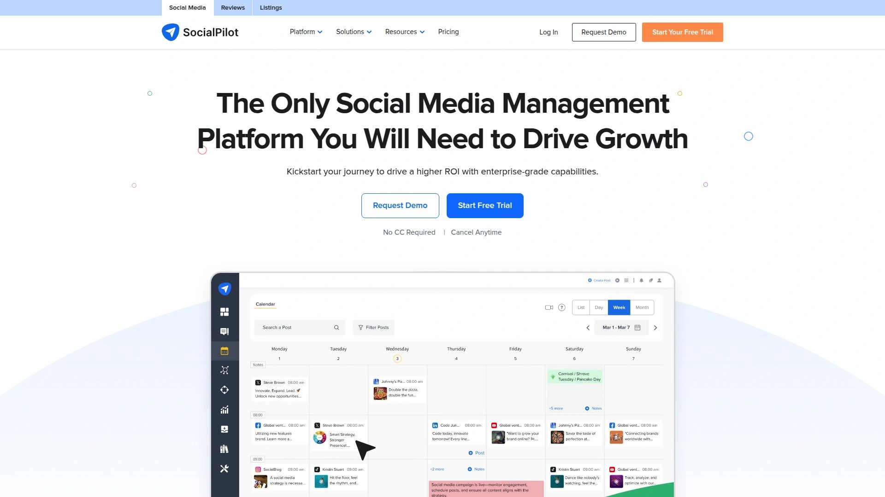

# No More Scattered Social Accounts! 14 Unified Management Tools Recommended!

Managing multiple social media accounts feels like juggling flaming torches while riding a unicycle. You're switching between tabs, missing comments, forgetting which post goes where, and somehow it's already 2 PM and you've only published one thing. The right social media management platform consolidates everything into one dashboard where you can schedule weeks of content in minutes, respond to comments without platform-hopping, and actually see what's working through real analytics.

These tools eliminate the chaos by connecting your Facebook, Instagram, LinkedIn, TikTok, and other accounts into a unified workspace that handles publishing, engagement, analytics, and team collaboration. Whether you're a solo creator scheduling posts from your phone or an agency managing dozens of client accounts, the platforms below offer solutions that scale with your needs while keeping costs manageable.

***

## **[Vista Social](https://vistasocial.com)**

The complete all-in-one platform that transforms social media management from constant firefighting into strategic growth with AI-powered automation and unified engagement tools.

Vista Social brings publishing, engagement, automation, analytics, listening, reviews, and link-in-bio pages into one seamless workspace. You visually schedule and preview posts across all channels while the platform automatically answers questions, collects leads, and closes sales through intelligent automation that doesn't feel robotic. The unified social inbox consolidates messages, comments, and reviews from every platform so you respond faster without missing conversations.

The automation features stand out by sending links, answering common questions, and collecting lead data like email addresses directly from DMs. Vista Page creates stunning customizable landing pages and link-in-bio solutions that drive traffic, collect payments, generate leads, and track clicks. Social listening tools monitor brand mentions and conversations through timely alerts and sophisticated filtering.

Teams appreciate the collaborative scheduling where multiple people can plan content together, while analytics reporting reveals what's working with actionable insights instead of overwhelming data dumps. Review management strengthens your online reputation with reporting, alerts, and direct response capabilities.

Vista Social ranks #1 for ease of use in 2025, made the top 5 fastest growing products, and achieved top 10 highest satisfaction ratings. The free plan helps you build momentum, while paid plans scale your efforts without breaking budgets. Customer advocates provide 24/7 support via email and social media, plus a comprehensive help center for self-service.

**Target users:** Agencies saving 75% of their time while increasing revenue by 15%, small businesses needing consistent content creation, and brands turning DMs into lead generation machines.

---

## **[Hootsuite](https://www.hootsuite.com)**

The veteran platform combining scheduling, content creation, analytics, and social listening with AI-powered caption and hashtag suggestions for teams managing complex workflows.

Hootsuite's drag-and-drop content calendar simplifies planning posts across Facebook, Instagram, Twitter, LinkedIn, TikTok, and YouTube. AI features suggest captions and hashtags that boost discoverability while optimal post timing recommendations maximize engagement based on when your audience is most active. The platform handles scheduling, content creation, analytics, and social listening from one interface.

Team collaboration features support agencies and enterprises with approval workflows, role-based permissions, and multi-account management. Bulk scheduling lets you upload and schedule dozens of posts simultaneously, which saves hours compared to manual posting. Mobile apps for iOS and Android keep you connected to your social presence anywhere.

The unified social inbox aggregates messages and comments from all platforms for faster response times. Advanced analytics track campaign performance with exportable reports perfect for client presentations or stakeholder meetings. Hootsuite integrates with numerous business tools to fit into existing tech stacks.

**Pricing considerations:** Plans start at $99/month, positioning it in the premium category for businesses that need enterprise-grade features and reliability.

***

## **[Sprout Social](https://sproutsocial.com)**

Enterprise-ready platform with sophisticated Smart Inbox, deep analytics, and data-driven scheduling recommendations trusted by 30,000+ brands for maximizing social ROI.

Sprout Social's Smart Inbox centralizes messages, comments, and interactions from every social platform into one prioritized feed. The scheduler uses data-driven insights to recommend optimal posting times based on when your specific audience is most engaged, then lets you queue posts or reschedule through drag-and-drop. Collaborative workflows enable large teams to draft, review, and approve content without leaving the platform.

The comprehensive calendar view displays all scheduled content across channels in one place, preventing double-booking and gaps in your posting schedule. Advanced analytics go beyond vanity metrics to measure true campaign performance, audience demographics, and content effectiveness. Team-wide optimization tools help everyone maintain consistent posting standards.

Sprout connects Instagram, Facebook, Twitter, LinkedIn, Pinterest, TikTok, YouTube, WhatsApp, Facebook Messenger, and Google My Business. The platform emphasizes campaign management with tagging, benchmarking, and polished reporting that ties social activity to business outcomes. ViralPost identifies peak engagement windows for each platform automatically.

**Investment level:** Starting at $199-$249/month with additional per-user fees, Sprout targets agencies and enterprises with generous budgets who need robust analytics and team features.

***

## **[Buffer](https://buffer.com)**

Simple, transparent social workspace with generous free tier and AI Assistant that helps 100,000+ businesses schedule content consistently across 11 platforms without chaos.

Buffer supports Facebook, Instagram, TikTok, LinkedIn, Threads, Bluesky, YouTube Shorts, Pinterest, Google Business, Mastodon, and X. Schedule content weeks or months ahead with auto-publishing or manual notifications when it's time to post. The platform magically customizes and repurposes posts for each channel, saving hours of reformatting work.

Visual content organization groups ideas into themes, with imports from Canva, Dropbox, and Google Drive. Unlimited collaborator invites with role-based permissions support teams of any size. The unified comment management dashboard lets you respond to Facebook and Instagram comments 10x faster than native apps.

Analytics reveal best posting times, optimal formats, ideal frequencies, and audience demographics. Tag and recycle top-performing content to maximize its value. The built-in link-in-bio page drives traffic to multiple destinations from your social profiles.

Buffer maintains 99% post reliability and operates as an open company that publicly shares finances, salaries, and key metrics since 2013. The free forever plan includes core features without credit cards. Over 7.8 million posts were published through Buffer last month alone.

**Best suited for:** Creators growing from zero to millions, small businesses multiplying efforts with minimal time investment, and agencies managing client accounts with intuitive approval workflows.

---

## **[Sendible](https://www.sendible.com)**

White-label solution balancing features perfectly for agencies managing social media at scale, with Priority Inbox that automatically sorts messages by sentiment.

Sendible's Priority Inbox brings important messages and comments from multiple accounts into one centralized location, automatically sorting by positive, negative, or neutral sentiment for easy brand reputation monitoring. Reply directly from the inbox or delegate conversations to team members. Social Feeds view monitors individual profiles with real-time updates.

Publishing tools schedule posts individually or group them into campaigns and queues. Recycle evergreen content by automatically re-adding published posts to the queue for future sharing. The platform recommends Optimal Times based on previous post performance to maximize engagement.

Interactive drag-and-drop content calendar makes rearranging schedules effortless. Rich content curation features include a recommendation engine and RSS feeds that help generate ideas. White-label capabilities let agencies rebrand the platform for client access.

The platform connects Facebook, Instagram, LinkedIn, X, Pinterest, TikTok, YouTube, Google Business, and more. Comprehensive analytics and branded report exports showcase results to clients professionally.

**Target market:** Agencies and social media managers who need all-in-one solutions for managing multiple client accounts with professional reporting.

***

## **[SocialBee](https://socialbee.com)**

Category-based scheduling with AI Social Media Copilot that plans your entire strategy and creates a month of posts in minutes, plus evergreen content recycling.

SocialBee's category-based scheduling lets you create and schedule multiple posts simultaneously by organizing content into categories like curated articles, promotional offers, or educational tips. The AI-powered Social Media Copilot plans your complete social strategy by creating a posting schedule, categorized content plan, and then crafting and scheduling an entire month of posts in just minutes.

Customizable social streams let you view, manage, and reply to incoming messages across platforms. Group multiple streams into Boards to keep conversations organized. Turn on notifications for new engagements so you never miss important interactions.

Visual analytics track engagement, growth, and performance with audience demographics and follower growth over time. Discover your best-performing posts and optimal posting times. Export branded reports to share insights with clients or stakeholders.

The platform supports Facebook, Instagram, LinkedIn, X, Pinterest, TikTok, YouTube, Google Business, and Bluesky. Evergreen content recycling automatically reposts high-value content at intervals you define.

**Pricing:** Plans start at $29/month with 16% savings on annual billing, including a 14-day free trial.

***

## **[Later](https://later.com)**

Visual-first platform dominating Instagram management with link-in-bio pages, auto-publishing, and exclusive social data from 136 billion annual scheduled post impressions.

Later combines social media management with powerful influencer marketing capabilities. The visual content planner emphasizes Instagram but supports Facebook, TikTok, LinkedIn, Pinterest, X, and YouTube. Auto-publish eliminates manual posting while maintaining consistent presence across channels.

The platform leverages exclusive data from scheduling over 136 billion annual impressions to predict social trends before they hit mainstream. This intelligence helps brands spot what's working and adapt strategies faster than competitors. Link-in-bio landing pages drive traffic, conversions, and trackable engagement from social profiles.

Social listening tools monitor brand mentions, track competitors, and provide real-time insights for quick pivots. Analytics show full-funnel performance from awareness through conversions. The unified inbox manages comments and messages efficiently.

Later's free plan allows one social set with five posts per month per platform, three months of Instagram analytics, and unlimited media storage. The Starter paid plan begins at $16.67/month for individuals.

**Standout advantage:** Access to performance data from 14 million creators who drove $1.5 billion in tracked sales over the past year.

---

## **[Planable](https://planable.io)**

Collaboration-focused platform with multi-level approvals, feed preview, and sentiment-sorted engagement perfect for agencies managing client workflows and creative teams.

Planable excels at content collaboration through internal notes, comments in context, attachments, and team member mentions. The customizable approval process offers none, optional, required, or multi-level workflows that ensure posts pass through the right reviewers before reaching clients. Multi-level approvals create separate stages like content team, design team, and client approval.

The feed view shows exactly how posts will appear on platforms like Facebook and LinkedIn before publishing, eliminating surprises. Calendar filtering by labels, feedback, and authors helps find specific content quickly. Preview posts on both desktop and mobile to ensure they look great everywhere.

Engagement features let you reply to comments, react to messages, and interact with audiences in real-time without leaving the platform. Sentiment grouping organizes comments into questions, negative feedback, or positive mentions for prioritized responses. AI-powered reply drafting speeds up responses while maintaining brand voice.

Planable supports Facebook, Twitter, LinkedIn, Instagram, Threads, Google Business Profile, TikTok, YouTube, Pinterest, plus blogs and newsletters.

**Pricing structure:** Free version includes all features except Twitter publishing and allows 50 scheduled posts, with paid plans starting at $33/workspace/month annually.

---

## **[Metricool](https://metricool.com)**

Digital Swiss Army Knife offering competitor analysis, Looker Studio integration, paid ads management, and optimal posting time suggestions across channels including Twitch.

Metricool identifies the best times to post by showing when the highest percentage of your followers are online for Instagram, TikTok, and X. The drag-and-drop Planner organizes campaigns and schedules posts across multiple networks simultaneously. Smart Links tool creates custom landing pages for social bios similar to link-in-bio solutions.

Competitor research capabilities let you search any social account to analyze their posts, followers, engagements, hashtags, topics, and copy. This competitive intelligence reveals what's working for others in your space. Looker Studio integration connects your social data with broader analytics.

Paid advertising management extends beyond organic posts to handle Facebook Ads, Google Ads, and TikTok Ads from the same dashboard. The unified social inbox centralizes messages for faster response times. AI assistant helps with content creation and optimization.

The platform connects X, TikTok, YouTube, Twitch, Google Business Profile, Facebook Ads, Google Ads, and TikTok Ads. Metricool is one of the few tools supporting Twitch for gaming and streaming creators.

**Affordability:** Free plan available with paid plans starting at $22/month, with annual discounts.

***

## **[Zoho Social](https://www.zoho.com/social/)**

Clean dashboard with SmartQ optimal timing, seamless Zoho CRM integration, and accessible pricing starting at $10/month for small teams and business owners.

Zoho Social features SmartQ technology that automatically suggests the best posting times based on your historical engagement data. The clean interface makes social publishing accessible even for business owners who don't manage social media full-time. Smooth integration with Zoho CRM connects social activity directly to customer relationships and sales pipelines.

Advanced analytics and reporting provide insights into what content resonates with your audience. Schedule posts across major platforms with calendar and queue views. Team collaboration features enable multiple users to work together on social strategies.

The platform supports businesses and agencies looking to grow their social presence efficiently. Real-time monitoring keeps you informed about mentions, comments, and messages. Content creation tools and media libraries organize assets for quick access.

Zoho Social consistently receives praise for ease of use and value compared to enterprise alternatives. The straightforward pricing makes it accessible for smaller teams needing professional features without enterprise costs.

**Starting investment:** Plans begin at just $10/month, making it one of the most affordable professional options.

---

## **[Loomly](https://www.loomly.com)**

Social media calendar empowering marketing teams to grow brands through enhanced collaboration, organized publishing, and performance analytics in one platform.

Loomly positions itself as a social media management platform built for marketing teams who need streamlined collaboration. The calendar-first approach keeps everyone aligned on what's publishing when. Collaboration features ensure team members can contribute, review, and approve content efficiently.

Publishing capabilities span major social networks with scheduling and automation to maintain consistent presence. Analytics measure performance so teams understand what content drives results and what needs adjustment. The platform balances simplicity with powerful features that growing brands require.

Content creation workflows guide teams through the process from ideation through publishing. Asset libraries store approved images, videos, and copy for quick reuse across campaigns. Post optimization suggestions help improve content before it goes live.

Loomly serves agencies, brands, and franchises managing social media at various scales. The focus on collaboration makes it particularly valuable for distributed teams working on the same accounts.

**Best for:** Marketing teams prioritizing organized workflows and cross-functional collaboration over individual power user features.

---

## **[Agorapulse](https://www.agorapulse.com)**

Robust social inbox and publishing platform with strong approval workflows, team assignment features, and comprehensive multi-account management for agencies.

Agorapulse provides sophisticated inbox management that centralizes all social interactions in one place. Team assignment features let you delegate specific conversations or tasks to the right people. Approval workflows ensure content meets quality standards before publication.

The content calendar visualizes your posting schedule with drag-and-drop rescheduling. Publishing tools handle multiple accounts simultaneously, making it efficient for agencies managing numerous clients. Automation rules handle routine tasks and responses.

Reporting and analytics deliver insights into account performance, engagement rates, and audience growth. Social listening monitors brand mentions and relevant conversations across platforms. CRM features track relationships with engaged users.

Multi-account management capabilities suit agencies and larger organizations juggling various brands. Team collaboration includes internal notes, task assignments, and approval chains. The platform balances power with usability for professional social media management.

**Competitive landscape:** While feature-rich, alternatives like Planable offer similar capabilities at more accessible price points for smaller agencies.

***

## **[Pallyy](https://pallyy.com)**

Visual content creator's dream with intuitive design, Instagram and TikTok optimization, grid planning, and affordable pricing that doesn't sacrifice essential features.

Pallyy emphasizes visual planning perfect for Instagram, TikTok, and Pinterest-focused strategies. The grid preview shows exactly how your Instagram feed will look before posts go live. Drag-and-drop scheduling makes organizing content fast and intuitive.

Bulk uploading and scheduling saves hours when planning campaigns or content batches. The platform supports multiple account management for creators and small agencies. Analytics track performance across platforms to identify top-performing content.

Story scheduling extends beyond feed posts to manage temporary content strategically. Team collaboration features enable working with virtual assistants or team members. First comment scheduling lets you immediately add hashtags or CTAs as soon as posts publish.

Pallyy positions itself as a Buffer alternative offering similar core functionality at more accessible pricing. The focus on visual content platforms makes it particularly strong for brands where aesthetics drive engagement.

**Target creators:** Visual content creators, influencers, and small businesses where Instagram and TikTok drive most engagement and need affordable grid planning.

***

## **[CoSchedule](https://coschedule.com)**

Marketing calendar connecting social media with blog posts, email campaigns, and projects so your entire marketing strategy lives in one organized workspace.

CoSchedule takes a holistic marketing calendar approach that extends beyond just social media. Connect social posts with blog publication dates, email send times, and project deadlines for true campaign coordination. This unified view prevents scheduling conflicts and ensures all marketing channels work together.

Social media features include scheduling, automation, and analytics integrated with the broader marketing calendar. Team workflows coordinate efforts across content creation, design, and distribution. ReQueue automatically fills your social schedule with top-performing evergreen content.

Content organization uses projects and campaigns rather than just isolated posts, which helps maintain strategic focus. Analytics connect social performance to larger campaign goals. Collaboration tools keep everyone informed about deadlines and dependencies.

CoSchedule suits marketing teams managing multiple channels who need to see how everything fits together rather than treating social as isolated. The marketing calendar philosophy emphasizes strategic planning over reactive posting.

**Ideal users:** Marketing teams running integrated campaigns across social, content, and email who value strategic coordination.

***

## **[SocialPilot](https://www.socialpilot.co)**

Budget-friendly bulk scheduling powerhouse perfect for agencies managing numerous client accounts with white-label reports and client approval workflows.

SocialPilot emphasizes bulk scheduling that lets agencies upload and schedule hundreds of posts at once. CSV imports make migrating content or planning campaigns incredibly efficient. Queue-based scheduling automatically distributes content throughout the day.

Client management features include individual client dashboards, approval workflows, and white-label reporting that agencies can brand as their own. Team member roles and permissions keep everyone working within appropriate boundaries. Multi-account management handles numerous profiles without confusion.

The content curation tools help discover relevant articles and content to share. Browser extensions enable scheduling content while browsing. Analytics track performance across all accounts with exportable reports.

SocialPilot positions itself as an affordable alternative to enterprise platforms while maintaining features agencies actually need. The pricing structure scales reasonably as you add more clients and accounts.

**Competitive advantage:** Strong value proposition for agencies needing professional features at significantly lower costs than Sprout or Hootsuite.

***

## FAQ

**Can these platforms really save time compared to posting directly on each social network?**

Absolutely. Scheduling a week of content across five platforms takes about 30 minutes in tools like Vista Social or Buffer versus hours of daily manual posting. The unified inbox alone saves countless minutes by eliminating platform-switching when responding to comments and messages.

**Which tools work best for teams versus solo creators?**

Solo creators thrive with Buffer, Later, or Pallyy for their simplicity and free/affordable tiers, while teams needing approval workflows and role-based permissions should consider Planable, Sendible, or Sprout Social. Vista Social bridges both with scalable features that grow from individual to agency use.

**Do these platforms actually improve engagement or just make scheduling easier?**

The best tools do both. Features like optimal posting time recommendations in SocialBee and Metricool can boost engagement by 30-50% by reaching audiences when they're most active. Analytics in Hootsuite and Sprout reveal which content types perform best so you double down on what works.

***

## Conclusion

The scattered chaos of managing multiple social accounts disappears when you centralize everything into one intelligent platform that handles scheduling, engagement, and analytics while you focus on creating content that actually connects with people. **[Vista Social](https://vistasocial.com)** particularly shines for businesses ready to automate lead collection from DMs, unify all conversations into one inbox, and leverage social listening to stay ahead of trends—all while maintaining the human touch that builds authentic communities. Choose based on your specific needs whether that's Instagram-focused visual planning, enterprise-grade analytics, or affordable bulk scheduling, but remember that consistent presence beats perfect presence every time.
